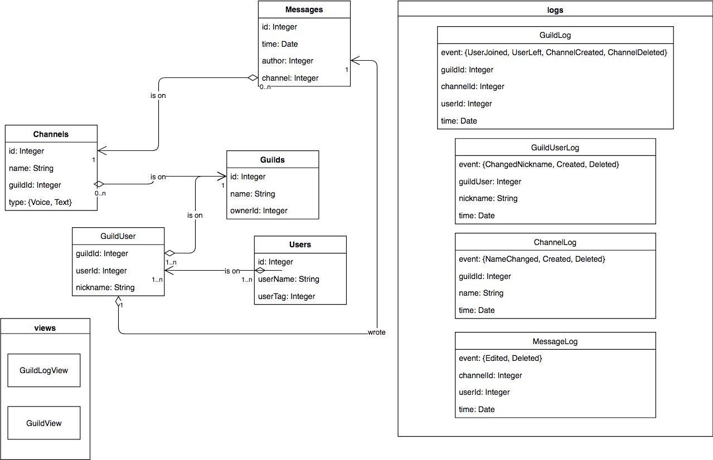

    

<h1 align="center">Discord Stats Bot</h1>
<h5 align="center">A very cool bot</h5>

Project focused mainly on database-side of things, uses MySQL, Node.js, Discord.js and MySQL2 connector. Saves logs about messages, deletions, edits, channels, guild, users and more, allows to use customizable commands and own queries to fetch data from the DB.

#### Structure

There are several important directories in the repository:

- [init](init/) - holds initialization files with init script, `init.js`
- [config](config/) - is created after initialization, holds important, sensitive data
- [main.js](main.js) - entry point for the app, launches it
- [util](util/) - utility modules
- [connectors](connectors/) - modules that interact with the DB directly
- [handerls](handlers/) - responsible for reacting to changes on the tracked guilds
- [messageInterpreter.js](messageInterpreter.js) - interprets messages and launches commands
- [commands](commands/) - command files with `run(msg)` function and `help` object

Initialization and backups work only on a server with `mysql` and `mysqldump` in the `PATH`, also init won't work if the defualt shell doesn't accept input stream redirection operator < (to be fixed in later updates).

#### Operation and comands

Bot operates by reading all the changes on the guilds, interpreting them and inserting, deleting and updating its database accordingly. It allows to gather statistics much faster than using Discord's search bar. All currently implemented commands can be accessed via `help` and each one is described via `help <command name>`.

#### DB tables

This diagram represents the structure of created database:

Futher specs are defined in [specification](bd-specyfikacja.pdf) (polish).

#### Developement stage

App is currently in alpha-ish state, so the functionality is limited and not everything will work perfectly.